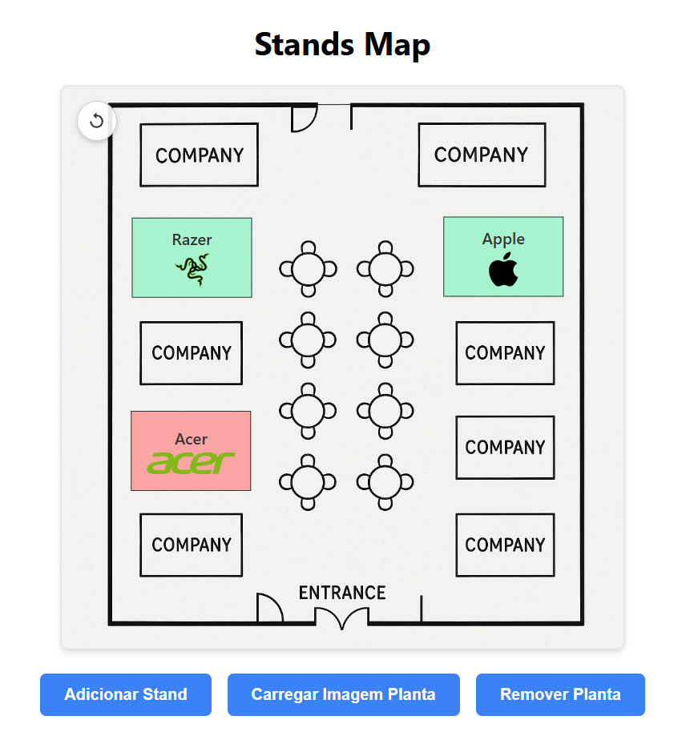
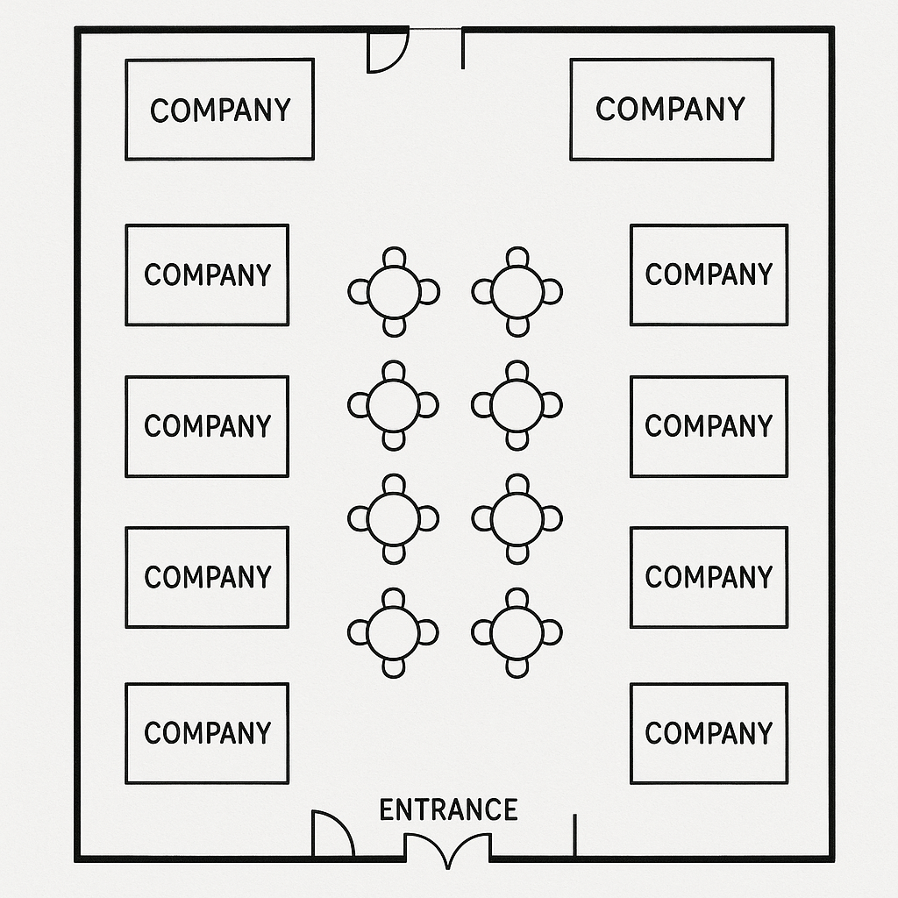

# Mapa Interativo de Stands - Desafio Front-End Angular

## 🚀 Aplicação em Produção

**[Clique aqui para ver a aplicação ao vivo\!](https://stands-map.vercel.app)**

-----

## 📄 Sobre o Projeto

A aplicação simula um mapa interativo para um evento de empresas, permitindo o gerenciamento, visualização e "compra" de stands de forma dinâmica e interativa.

O objetivo principal é demonstrar habilidades em componentização, manipulação de estado, interatividade com a DOM e organização de código.
-----

## ✨ Funcionalidades

A aplicação conta com as seguintes funcionalidades:

#### Gerenciamento de Stands

  - [x] **Adicionar:** Criação de novos stands no mapa.
  - [x] **Editar:** Edição de informações de stands existentes (nome, descrição, logo) através de um painel lateral.
  - [x] **Mover:** Arrastar e soltar (`drag-and-drop`) os stands livremente pela área do mapa.
  - [x] **Comprar:** Um usuário pode simular a compra de um stand, alterando seu status para "ocupado" e seu visual.

#### Interatividade do Mapa

  - [x] **Zoom:** Zoom in e out com o scroll do mouse.
  - [x] **Pan:** Arrastar o mapa clicando e segurando no fundo para navegar.
  - [x] **Limite de Borda:** Os stands não podem ser arrastados para fora da área do mapa.
  - [x] **Planta Baixa Dinâmica:** Carregamento de uma imagem de planta baixa para servir de fundo para o mapa. A área do mapa se ajusta para ter a mesma proporção da imagem carregada.
  - [x] **Controles de Visualização:** Botões para resetar o zoom/pan e para remover a planta baixa carregada.

#### UI/UX

  - [x] Painel de edição lateral com animação suave.
  - [x] Design limpo e responsivo.
  - [x] Feedback visual claro para ações, como cursores diferentes para arrastar o mapa ou um stand.

-----

## 🛠️ Tecnologias Utilizadas

  - **Framework Principal:** **Angular**
  - **Linguagens:** TypeScript, SCSS, HTML5
  - **Bibliotecas Chave:**
      - **Angular CDK:** Utilizado para a funcionalidade de Drag & Drop dos stands.
      - **RxJS:** Usado para o gerenciamento de estado reativo através de `BehaviorSubject`.
  - **Ferramentas:**
      - Angular CLI
      - Git & GitHub
  - **Deploy:**
      - **Vercel**

-----

## ⚙️ Como Rodar o Projeto Localmente

Siga os passos abaixo para executar a aplicação na sua máquina.

### Pré-requisitos

Antes de começar, você vai precisar ter as seguintes ferramentas instaladas:

  - [Node.js](https://nodejs.org/en/)
  - [Angular CLI](https://angular.io/cli): `npm install -g @angular/cli@16.2.16`

### Passos

1.  **Clone o repositório:**

    ```bash
    git clone https://github.com/LansyLord/stands-map
    ```

2.  **Navegue para a pasta do projeto:**

    ```bash
    cd stands-map
    ```

3.  **Instale as dependências:**

    ```bash
    npm install
    ```

4.  **Execute a aplicação:**

    ```bash
    ng serve
    ```

5.  **Acesse no navegador:**
    Abra seu navegador e acesse `http://localhost:4200/`. A aplicação será recarregada automaticamente se você alterar qualquer um dos arquivos de origem.

-----

## 📸 Screenshots



-----

## 📸 Imagem exemplo utilizada



-----
